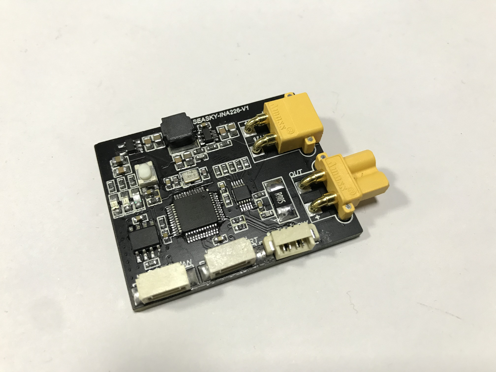
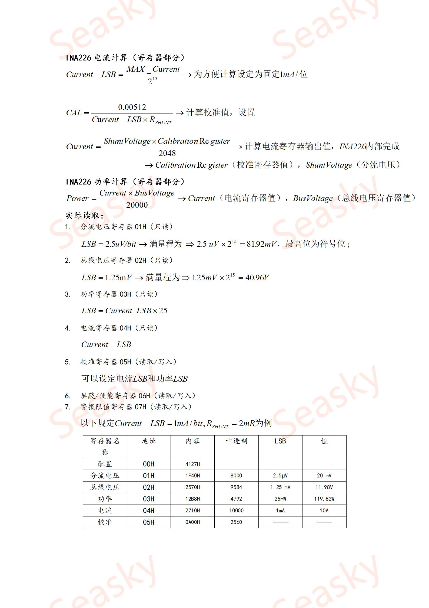
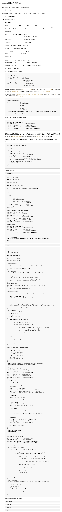

# SEASKY-INA226技术手册

## 项目开源

[https://github.com/SEASKY-Master/Seasky_INA226](https://github.com/SEASKY-Master/Seasky_INA226.git)

## 参数说明
  
  - 输入限制 <= 40V
  - 模块限制分流电压 81.92mV
  - 使用5mR采样电阻，则最大可测量电流为16.384A,最大功率为640W(理论值)
  - 实际测试 输入电压24V 输入电流6A 功率144W 没有问题，我感觉跑15A应该是没有问题的，限于测试条件，直流源最大输出6.1A，因此更大电流无法测试。

## 实物

## 协议
------------------

因该模块源码程序已经开源，故该模块程序设定为只输出，不能进行通信控制，需要修改输出协议可以直接修改源码

1. USART
- 通信要求 
  
    配置为波特率 115200，8 位数据位，1 位停止位，无硬件流控，无校验位,发送频率100Hz
- 接口协议说明
  
  Seasky串口通信协议-详情见`Seasky串口协议`
  
  - INA226模块数据(float数据长度- 4)
      | 数据            | 说明                  |
      | --------------- | --------------------- |
      | INA226_USART_ID | 0X0002                |
      | ina226_flag     | CAL(INA226设定校准值) |
      | float_data[0]   | Power_Val             |
      | float_data[1]   | voltageVal            |
      | float_data[2]   | Shunt_Current         |
      | float_data[3]   | Shunt_voltage         |

- 函数发送接口
  
      void ina226_uart_send(void)
      {
        static float tx_data[4];
        static uint8_t tx_buf[50];
        static uint16_t tx_buf_len;
        static uint16_t tx_len;
        
        tx_data[0] = ina226_data.Power;			//功率mW
        tx_data[1] = ina226_data.voltageVal;	//mV
        tx_data[2] = ina226_data.Shunt_Current;	//mA
        tx_data[3] = ina226_data.Shunt_voltage;	//uV
        get_protocol_send_data
        (INA226_USART_ID,	 	  		//信号id
        CAL,  //16位寄存器
        &tx_data[0],	  		//待发送的float数据
        4,   			  		//float的数据长度
        &tx_buf[0],		  		//待发送的数据帧
        &tx_buf_len);	  		//待发送的数据帧长度
        for(uint16_t i=0; i<tx_buf_len; i++)
          {
                  while((USART1->SR&USART_FLAG_TC)==0);//发送完成
                  USART_SendData(USART1,tx_buf[i]);
          }
      }

2. CAN
- CAN波特率1MHZ、发送频率100Hz    
- 协议部分

- 协议说明（单次发送-单个ID）

  - 信号数据
  
      | ID    | union    | uint16_t      | u8         |
      | ----- | -------- | ------------- | ---------- |
      | 0X311 | 功率     | Power_Val     | data_u8[2] |
      |       | 电压     | voltageVal    | data_u8[2] |
      |       | 电流     | Shunt_Current | data_u8[2] |
      |       | 分流电压 | Shunt_voltage | data_u8[2] |
  

  功率测量模块发送数据函数接口

      void can_send_msg(s16 mt1,s16 mt2,s16 mt3,s16 mt4)
      {
        CanTxMsg TxMessage;
        TxMessage.StdId= CAN_Tx_Msg ;	    // 标准标识符 
        TxMessage.ExtId= 0;			    // 设置扩展标示符 
        TxMessage.IDE=CAN_Id_Standard; 	// 标准帧
        TxMessage.RTR=CAN_RTR_Data;		// 数据帧
        TxMessage.DLC=8;				    // 要发送的数据长度
          TxMessage.Data[0] = mt1 >> 8;
          TxMessage.Data[1] = mt1;
          TxMessage.Data[2] = mt2 >> 8;
          TxMessage.Data[3] = mt2;
          TxMessage.Data[4] = mt3 >> 8;
          TxMessage.Data[5] = mt3;
          TxMessage.Data[6] = mt4 >> 8;
          TxMessage.Data[7] = mt4;		          
          CAN_Transmit(CAN1, &TxMessage);   
      }

      void ina226_can_send(void)
      {
        s16 tx_data[4];
        tx_data[0] = ina226_data.Power;			//功率mW
        tx_data[1] = ina226_data.voltageVal;	//mV
        tx_data[2] = ina226_data.Shunt_Current;	//mA
        tx_data[3] = ina226_data.Shunt_voltage;	//uV
        can_send_msg(tx_data[0],tx_data[1],tx_data[2],tx_data[3]);
      }

3. INA226配置说明
   更多的介绍你可以查询手册获得
   

4. 串口协议说明
    
   